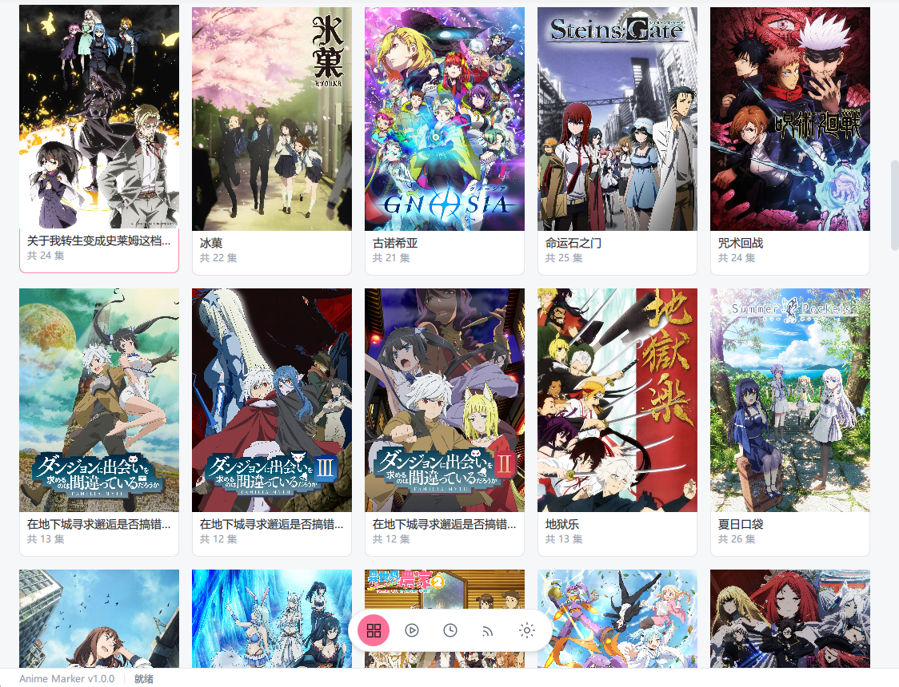
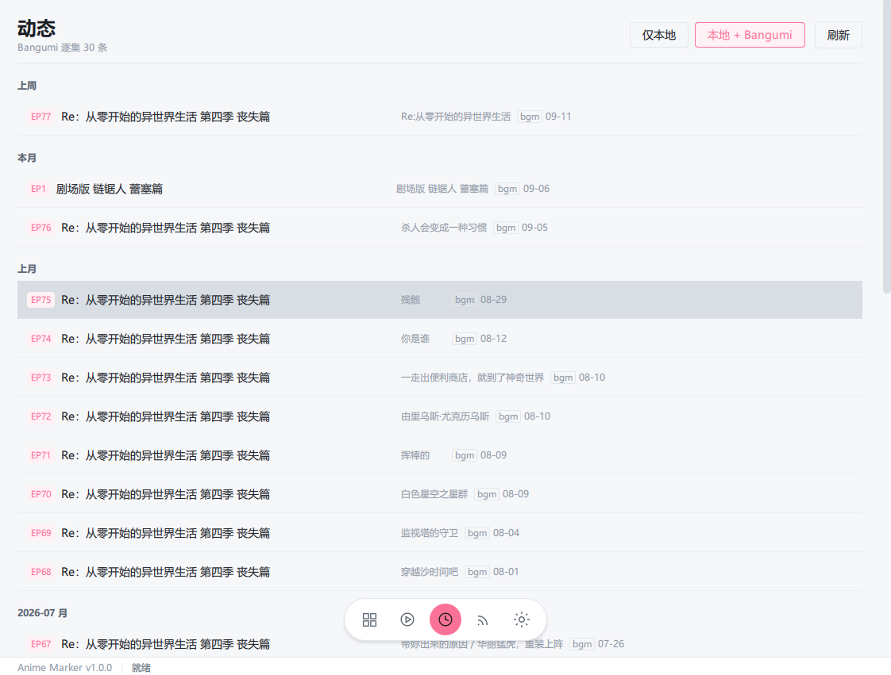
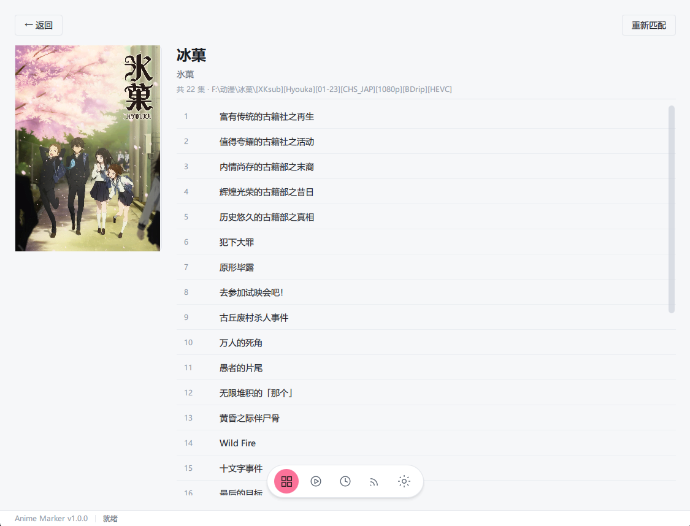
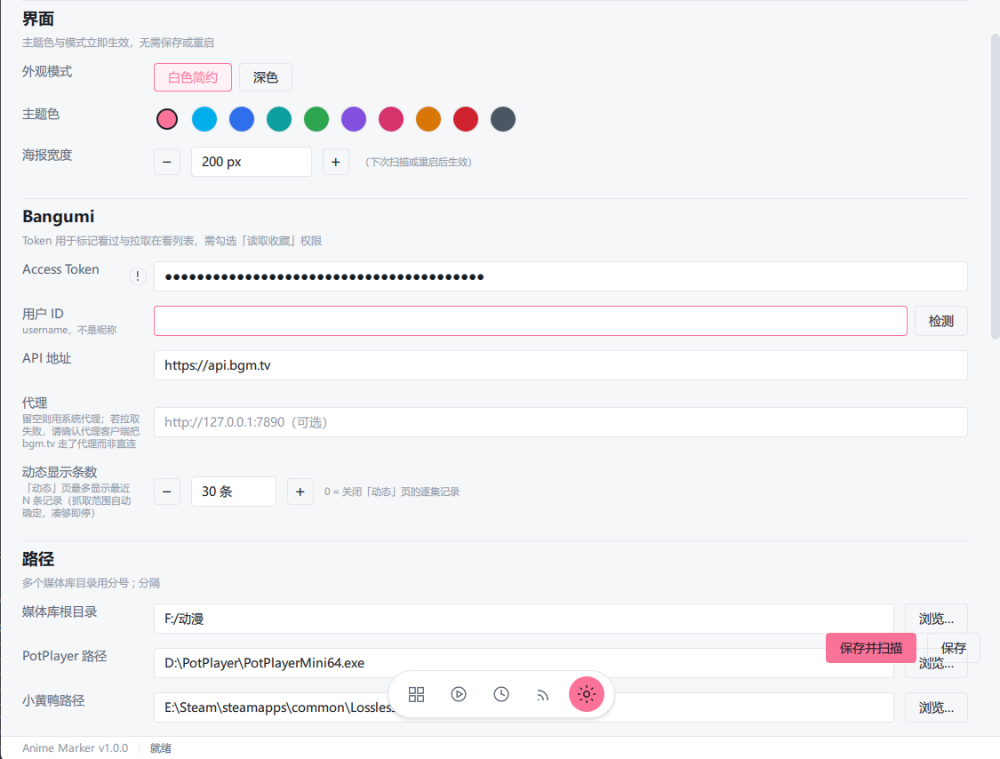

# Anime-Marker

Windows 桌面端本地动漫管理 + Bangumi 进度同步 + PotPlayer 播放联动工具。

用 Python + PySide6（QML 界面）写成，把自己硬盘上的动画和 Bangumi 上的观看记录对起来：
**自动匹配条目 → 一键播放（可联动插帧）→ 看完自动标记 → 在应用里回看观看动态**。

---

## 功能特性

**媒体库与海报墙**

- 扫描本地目录（支持多个根目录，分号分隔），自动提取标题、季数、集数
- 调 Bangumi 搜索接口逐个匹配，按匹配度打分；低分条目进「待确认」，可手动指定或重新匹配
- 海报墙支持**平铺 / 按系列聚合**两种展示；封面下载后本地缓存，断网也能出图
- 条目详情页：集列表、已看进度、播放、手动标记看过、重新匹配

**播放联动**

- 用 PotPlayer 打开（外部进程，不内置播放器）
- 可联动 Lossless Scaling（小黄鸭）自动开插帧
- 读取 PotPlayer 窗口标题解析播放进度，到阈值（默认 95%）自动标记该集「看过」

**Bangumi 集成**

- 在看页：列出正在追的番（整部番状态为「在看」），与本地区目关联，点行进详情
- 动态页：**逐集观看时间线** —— 本地播放记录 + Bangumi 逐集标记混排，按天分组（今天 / 昨天 / 本周 / 上周 / 本月 / 上月 / 月份）；覆盖**全部收藏状态**（在看 / 看过 / 搁置 / 抛弃…，只要标过单集就有记录），向下滚动可加载更多
- 支持「本地 + Bangumi」与「仅本地」两种视图；点行进详情，返回回到来源页

**RSS 订阅与自动下载**

- 管理 RSS 源（Mikan / dmhy 等标准 RSS 2.0 / Atom），按规则筛选
- 三层查重后推送 qBittorrent 下载（本程序不实现 BT 协议，只调 qB 的 Web UI API）

**其他**

- 亮色 / 暗色主题 + 可换主题色
- 全离线可用：收藏、集级记录、封面都有本地缓存
- 网络失败有分类提示（区分「服务端故障」与「本地链路/代理问题」，见下方常见问题）

---

## 环境要求

| 项 | 要求 |
| --- | --- |
| 系统 | Windows 10 / 11（依赖 `win32gui` 读播放器窗口标题）|
| Python | **3.10 或更高**（用到 `X \| None` 等新语法）|
| PotPlayer | 播放功能需要（[下载](https://potplayer.daum.net/)）|
| Lossless Scaling | 可选，用于自动开插帧 |
| qBittorrent | 可选，订阅自动下载需要（需开启 Web UI）|
| Bangumi 账号 | 可选，但「收藏 / 动态」需要 Access Token |

## 安装与运行

```cmd
pip install -r requirements.txt
python main.py
```

## 首次配置

在「设置」页填写以下内容后点击「保存并扫描」：

| 配置项 | 说明 |
| --- | --- |
| **Bangumi Token** | 获取地址：**<https://next.bgm.tv/demo/access-token>**（请勾选「读取收藏」权限，否则收藏列表无法拉取） |
| Bangumi 用户名 | 收藏列表需要；留空则尝试用 Token 解析 |
| 媒体库根目录 | 本地动漫所在目录，多个用英文分号 `;` 分隔 |
| PotPlayer 路径 | `PotPlayerMini64.exe` |
| 小黄鸭路径 | `LosslessScaling.exe`（可选，用于自动开启插帧） |
| qBittorrent | 订阅自动下载需要；需在 qBittorrent 中开启 Web UI |
| 代理 | 可选。国内网络访问 `bgm.tv` 可能需要，见「常见问题」 |

> PotPlayer 需在「选项 → 播放 → 窗口标题」中加入播放时间/总时长字段（如 `%playtime% / %totaltime%`），否则无法自动识别播放进度。

## 截图

**海报墙** —— 封面本地缓存，断网也能出图



**动态** —— 本地播放记录与 Bangumi 逐集标记混排的时间线



**条目详情** —— 集列表、已看进度、播放与重新匹配



**设置** —— Token / 路径 / 阈值 / 代理 / 主题



---

## 常见问题

更新中

---

## 目录结构

```
main.py                 入口（run_qml.py 为兼容转发）
app/qml/                QML 界面（页面、组件、Theme 单例）
app/bridges/            QML ↔ Python 桥接层（Property / Signal / Slot）
app/core/               业务逻辑（scanner / matcher / bangumi_api / monitor /
                        launcher / database / config / rss_* / qbittorrent_api）
app/utils/              工具（paths / logger / cover_cache / title_parser / bgm_log）
resources/icons/        图标
data/                   运行时数据（SQLite 库、封面缓存、日志）—— 自动生成，不入库
```

## 打包（可选）

```cmd
pip install -r requirements-dev.txt
pyinstaller anime_marker.spec --noconfirm --clean
```

产物在 `dist/AnimeMarker/`（单目录形式，含 Qt 运行库与许可证文件）。

---

## 第三方许可

本项目以 **MIT** 发布（见 [LICENSE](LICENSE)）。运行时依赖及其许可证见 **[THIRD_PARTY_LICENSES.md](THIRD_PARTY_LICENSES.md)**，其中 **PySide6（LGPLv3）** 对分发有额外要求，打包时已把许可证文件一并放进产物目录。

## 声明

- 本程序与 Bangumi 官方无关，仅通过其公开 API 读取数据；**不写入**任何收藏状态。
- API 调用遵守 Bangumi 的 [User-Agent 约定](https://github.com/bangumi/api/blob/master/docs-raw/user%20agent.md)（见 `app/__init__.py` 的 `USER_AGENT`）。
- 请自行确保所管理媒体内容的来源合法。

## 参与

`main` 分支受保护，不接受直接推送。欢迎 fork 后提 Pull Request。
