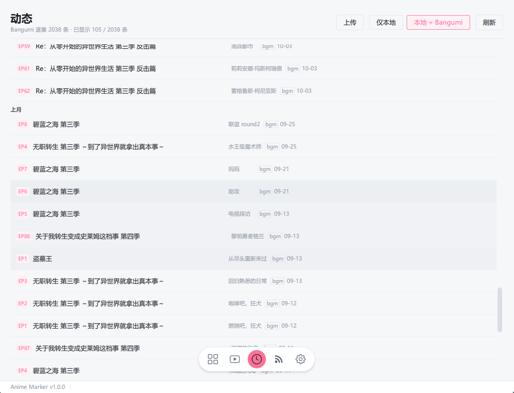
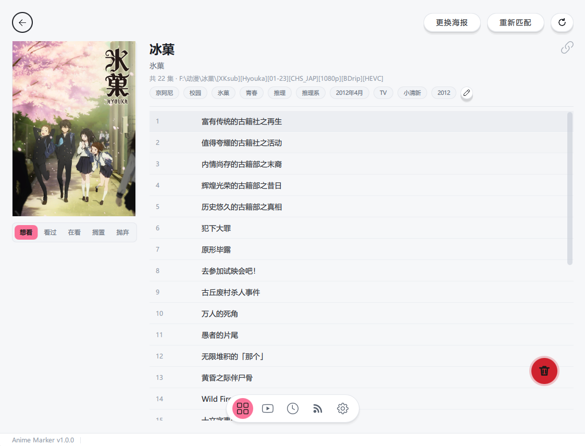
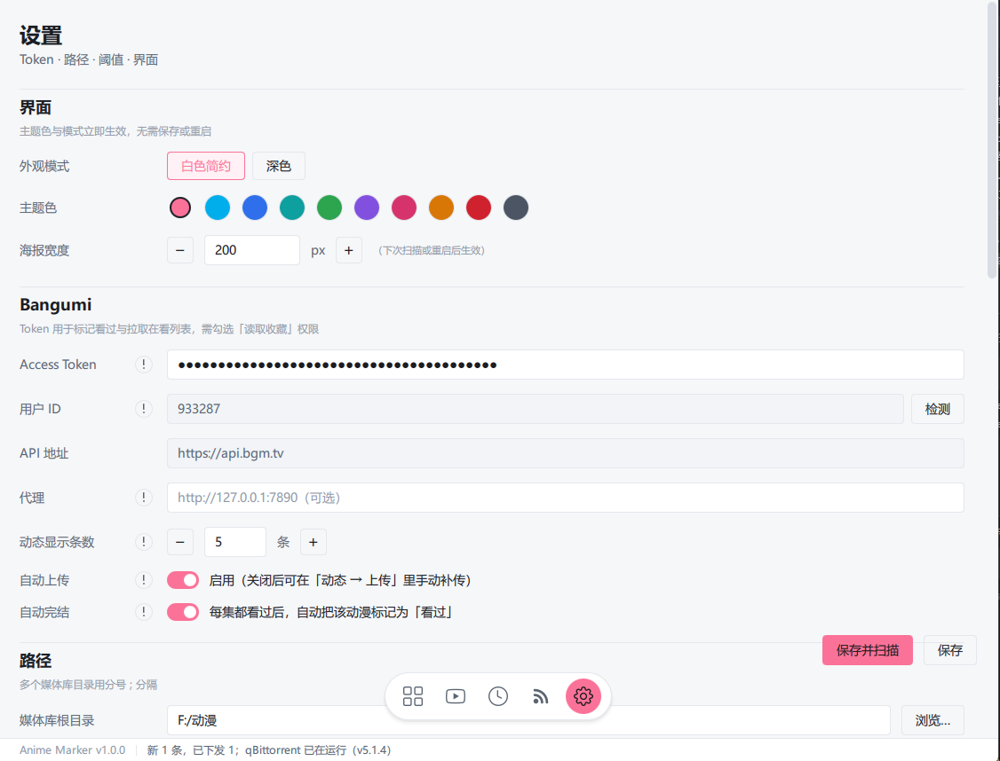

# Anime-Marker

Windows 桌面端本地动漫管理 + Bangumi 进度同步 + RSS 自动下载工具。

Python + PySide6（QML 界面）。核心闭环：
**扫描匹配 → 播放（可联动插帧）→ 看完自动标记 → RSS 自动追番下载**。

---

## 功能特性

**媒体库**

- 扫描本地目录（多个根目录用 `;` 分隔），提取标题、季数、集数
- 调 Bangumi 搜索接口自动匹配，按分数判定；低分条目进「待确认」，可手动指定或重新匹配
- 海报墙支持**平铺 / 按系列聚合**；封面本地缓存，断网也能出图
- 详情页：集列表、观看进度、播放、重新扫描、重新匹配

**播放联动**

- 用 PotPlayer 打开（外部进程，不内置播放器）
- 可选联动 Lossless Scaling（小黄鸭）自动开插帧
- 经 PotPlayer 原生接口读播放位置（不依赖窗口标题），到阈值（**默认 90%**）自动记录

**Bangumi 同步**

- 在看页：列出正在追的番，可看「下一集」、把本地记录「上传」补传
- 动态页：**逐集观看时间线**，本地记录（tag `本地`）与 Bangumi 标记（tag `bgm`）混排、按天分组
- 详情页可设收藏状态（想看 / 看过 / 在看 / 搁置 / 抛弃）并同步 Bangumi
- **自动完结**：一部番每集都看过后，自动把条目标为「看过」并同步（可关）

**RSS 自动下载**

- 管理 RSS 源，每个订阅独立配置判新规则（**只下新集** / **全部下载**）
- **两层查重**（本地媒体库 / qBittorrent 现有任务），推送 qBittorrent Web UI 下载
- **下载器**：标题必须包含 / 必须不包含过滤、指定保存位置、**实时预览会下载哪些集**
- 保存位置支持**按系列归位**（同系列各季下到 `番名\季` 子目录）
- 无人值守：程序启动即检查，之后按间隔轮询（总开关可关）

**其他**

- 亮/暗主题 + 可换主题色
- 网络失败分类提示（区分服务端故障与本地链路/代理问题）

---

## 环境要求

| 项 | 要求 |
| --- | --- |
| 系统 | Windows 10 / 11（依赖 `win32gui` 读播放器窗口与播放位置）|
| Python | **3.10+**（用到 `X \| None` 语法）|
| PotPlayer | 播放功能需要（[下载](https://potplayer.daum.net/)）|
| Lossless Scaling | 可选，自动插帧 |
| qBittorrent | 可选，RSS 下载需要（需开启 Web UI）|
| Bangumi Token | 可选，收藏 / 动态 / 自动上传需要 |

## 安装与运行

```cmd
pip install -r requirements.txt
python main.py
```

## 首次配置

「设置」页填写后点「保存并扫描」：

| 配置项 | 说明 |
| --- | --- |
| **Bangumi Token** | 获取：<https://next.bgm.tv/demo/access-token>（勾选「读取收藏」权限）|
| 媒体库根目录 | 本地动漫所在目录，多个用 `;` 分隔 |
| PotPlayer 路径 | `PotPlayerMini64.exe` |
| 小黄鸭路径 | `LosslessScaling.exe`（可选）|
| qBittorrent | 地址 / 端口 / 用户名 / 密码；可选填**程序路径**用于连不上时自动启动 |
| 代理 | 可选，国内访问 `bgm.tv` / `api.bgm.tv` 可能需要 |

### 关于「看完自动标记」

**不需要任何 PotPlayer 设置** —— 程序通过原生接口直接读播放位置（`WM_USER` 消息），
到阈值（默认 **90%**）就记录：

1. **先写本地**：这一集立刻进入「动态」页，来源标记 `本地`；
2. **再同步 Bangumi**：成功则该行同时带 `bgm` 标记；失败不影响本地记录，
   之后可在「动态 → 上传」补传。

「设置 → Bangumi → 自动上传」控制第 2 步：关掉只记本地（来源只有 `本地`），
**不会丢记录**，只是延迟同步。

### RSS 订阅怎么用

1. 订阅页「添加订阅」：填名称、RSS 地址、判新规则
2. 点「绑定条目」关联本地番剧；没有对应条目时可用「新建并绑定」直接建一个
3. 点「**下载器**」配置标题过滤与保存位置 —— **必须点保存，该订阅才会开始下载**
4. 点「立即检查」立即跑一次；开启「自动轮询」（设置页）则启动时与定时自动跑

> 判新规则的差别：「只下新集」会先查本地与 qBittorrent，已有的跳过；
> 「全部下载」两层都不查，把订阅源里的内容全部下发一遍（适合重新拉一份完整资源）。

### 让小黄鸭自动开插帧

以下四条要**同时**满足，缺一条就会"小黄鸭起来了但不补帧"：

1. **把小黄鸭的配置绑到 PotPlayer**（最关键）：小黄鸭里新建配置 →「筛选」→ 浏览选 `PotPlayerMini64.exe`。
   它按「跑的是哪个 exe」匹配配置。验证：播放时看小黄鸭状态栏 `配置:` 一行。
2. **该配置里打开「帧生成」**（新建配置常常是关的），「捕获 API」保持 `DXGI`。
3. **快捷键两边一致**：小黄鸭「设置 → 缩放快捷键」= 应用「设置 → 插帧快捷键」。
   ⚠️ 不要用 `Ctrl+Alt+L` —— 那是 QQ 的「锁定 QQ」全局快捷键，会被抢注并**把 QQ 锁掉**。
4. **PotPlayer 用 D3D11 类视频渲染器**（`F5 → 视频 → 视频渲染器`）。

## 截图

| 海报墙 | 动态 |
| --- | --- |
|  |  |

| 详情页 | 设置 |
| --- | --- |
|  |  |

---

## 目录结构

```
main.py                 入口（run_qml.py 为兼容转发）
app/qml/                QML 界面（页面、组件、Theme 单例）
app/bridges/            QML ↔ Python 桥接层（Property / Signal / Slot）
app/core/               业务逻辑（scanner / matcher / bangumi_api / monitor /
                        launcher / database / config / rss_* / qbittorrent_api）
app/utils/              工具（paths / logger / cover_cache / title_parser）
resources/icons/        图标（SVG）
data/                   运行时数据（SQLite 库、封面缓存、日志）—— 自动生成
```

---

## 第三方许可

本项目以 **MIT** 发布（见 [LICENSE](LICENSE)）。
运行时依赖的许可证说明见 **[THIRD_PARTY_LICENSES.md](THIRD_PARTY_LICENSES.md)**，
各许可证原文在 `licenses/`，打包时一并放入产物目录。

> **PySide6 是 LGPLv3**，对分发有额外要求：需随附许可证全文（已包含）。

## 声明

- 本程序与 Bangumi 官方无关，通过其公开 API 读写**你自己的**观看记录：
  只会把「你看完的集」标记为看过，以及在你主动操作时修改该条目的收藏状态；
  不涉及评分、吐槽等其他内容。
- API 调用遵守 Bangumi 的 [User-Agent 约定](https://github.com/bangumi/api/blob/master/docs-raw/user%20agent.md)。
- 请自行确保所管理媒体内容的来源合法。

## 参与

`main` 分支受保护，不接受直接推送。欢迎 fork 后提 Pull Request。
